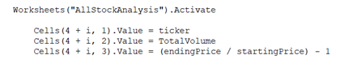

# STOCK ANALYSIS REFACTOR
## PROJECT OVERVIEW
### Purpose

The purpose of this project is to refactor the original “green stocks” code, in order to give Steve a solution that works for him, no matter how much stocks he needs to analyze and review.

### Background
The original code works for the eleven initial stocks that conforms Steves excel file. The information that Steve wants to see in a different sheet, is a summary of every ticker, including the total traded volume and the return of each stock since the first date until the last one.

## RESULTS

### Original Code

With the original code, for all the information contained in 2017, all the analysis ran in 0.7929688 seconds, retrieving the ticker name, the total volume traded and the return for the period; for 2018, the code used 2.117188 seconds to get the same information, as we can see in the next images:

To get those results, first was needed to define all the tickers as variables, in this case, as “string”

Then, the loop that will be walk through the variables in the years sheet, is defined:

Finally, for each round of the loop, and for every ticker, in new sheet, the sum of all the traded volume and the return from the beginning of the period until the end are obtained and displayed.

### Refactored Code
In order to get a most functional solution, the original “green_stocks” code was refactored, and now, with some changes, the new times for reviewing all the data and getting the summary with the volume information and return for every ticker are 0.4140625 seconds for year 2017 and 0.09375 seconds for 2018 as shown below:

The principal difference between this code and the original, is that here, an array with the tickers was defined:

And then, the loop ran in a similar way to the original one, looking through all the elements of the array, as noticed, the code changed in the reference “tickerindex, but all the rest looks very similar to “green_stocks”.

Finally, to get the results, another loop gives us the same volume and ticker information as before.

## SUMMARY
1.	In general, I think refactoring can be used to get the same results with less code or with a better instruction ordering; maybe a disadvantage is that you need to perfectly understand which was the purpose of the original code in order to make a new one “better”. I`m not sure about this but I believe that sometimes a code cannot be refactored because of its complexity.

2.	With this exercise, because we were checking the timer, is clear that the new code runs faster. In programming language, I found the refactored code remarkably similar to the original one. As a conclusion,  I found the refactoring very useful to understand what the code is doing, in order to try to make it better.
